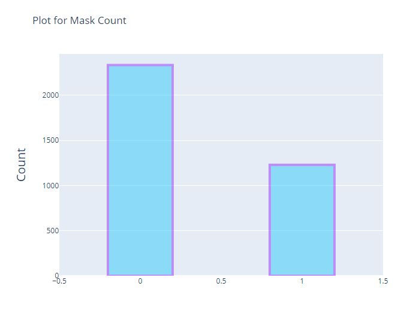
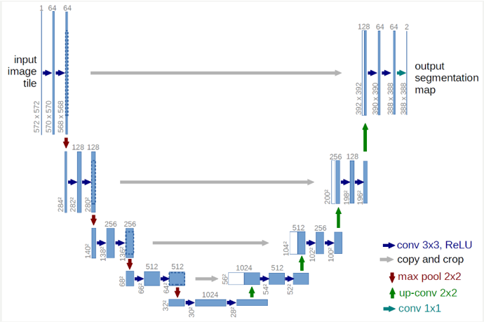
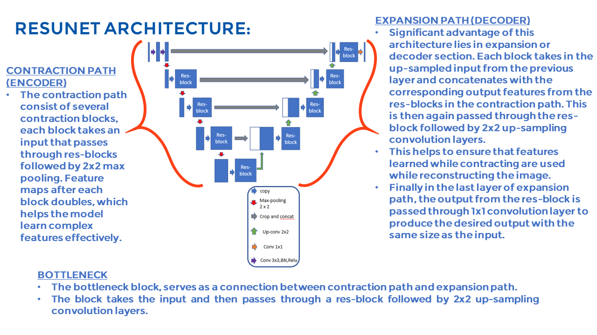

# Brain_Tumor_MRI_LFI_Project

### Introduction

Tumor genomic clusters refer to groups of genetic mutations that are frequently found together in tumors. These mutations can drive the growth and development of the cancer, and the clustering of certain mutations can provide insight into the underlying biology of the tumor and inform treatment decisions. In cancer genomics, the identification and analysis of tumor genomic clusters is an important tool for understanding the genetic changes that occur in cancer cells and for developing new treatments.  

In this project, segmentation masks for pictures of brain tumors are made using the U-Net Architecture and ResUnet

### Overview
- - - -
* Dataset
* Tools/IDE used
* Simple workflow
* Data visualization
* Methodology
* Evaluation and Result
* Challenges
* References

### Dataset Used

The dataset consists of MRI scans of the brain, along with manual segmentations of the tumors created by experienced radiologists. The segmentations serve as ground truth annotations and are used to evaluate the performance of algorithms designed to segment LGGs in MRI scans. The dataset can be used to train and test machine learning models, such as Convolutional Neural Networks (CNNs), for the task of brain tumor segmentation.

The LGG Segmentation Dataset is a valuable resource for researchers and practitioners in the field of medical imaging, and its use can lead to the development of more accurate and efficient algorithms for the detection and diagnosis of brain tumors. 

  
   

Here, Original Image and Masked Image

### Tools/IDE used

The project is developed in python using Jupyter notebook online and Kaggle GPU. we have used Kaggle GPU notebook online to show the flow of the application as it provides a block execution interface and each stage output can be shown effectively.

Machine Learning and Python Packages:
NumPy,
pandas,
Matplotlib,
Seaborn,
scikit-learn,
cv2,
tensorflow

 ### Simple workflow

### Data visualization
Mask Count Plot:

### Methodology

In one part we tried to use and train U-net model. In another part, we trained ResU-net model.
U-Net is a convolutional neural network (CNN) architecture that was developed for biomedical image segmentation. It consists of a contracting path to capture context and a symmetric expanding path that enables precise localization. The network is trained end-to-end, using a loss function that measures the difference between the predicted segmentation and the ground truth.

ResU-Net, on the other hand, is a variant of the U-Net architecture that incorporates residual connections into the network. These residual connections help to alleviate the vanishing gradient problem, which can occur in deep networks, by allowing gradients to flow more easily through the network during training. This can lead to improved convergence and better results.

The main difference between U-Net and ResU-Net is the addition of residual connections in the latter architecture.

U-Net is a fully convolutional neural network that consists of a contracting path to capture context and an expanding path that enables precise localization. The contracting path consists of repeated convolution, activation, and pooling operations, while the expanding path consists of upsampling and concatenation with features from the contracting path. 

ResU-Net extends the U-Net architecture by adding residual connections. Residual connections are connections that bypass one or more layers and directly add the input to the output of the layer. These connections help to mitigate the vanishing gradient problem, which can occur in deep networks and make it difficult for the network to learn from the input data. 

### Evaluation and Result

The predicted result in a brain tumor MRI detection task using U-Net or ResU-Net is a segmentation of the brain MRI scan, where each pixel is assigned to a class, such as "tumor" or "healthy tissue".

The quality of the predicted result is typically evaluated using metrics such as Dice Similarity Coefficient (DSC) or Intersection over Union (IoU). These metrics measure the overlap between the predicted segmentation and the ground truth segmentation. A high DSC or IoU indicates that the predicted segmentation is highly similar to the ground truth segmentation, while a low DSC or IoU indicates that the predicted segmentation is significantly different from the ground truth. 

It is important to note that the accuracy of the predicted result depends on many factors, including the quality of the training data, the choice of loss function, and the choice of architecture. 

Overall, the predicted result in a brain tumor MRI detection task using U-Net or ResU-Net is a segmentation of the MRI scan that indicates the regions corresponding to brain tumors, and its quality can be evaluated using metrics such as DSC or IoU.

### Challenges

Image Variability: MRI scans can have significant variability in terms of contrast, intensity, and resolution. This can result in different appearances of the same type of tumor in different images, making it challenging to develop algorithms that can accurately

Complexity of the model: The complexity of the model being used for training also affects the training time. More complex models, such as deep CNNs with multiple layers and large numbers of parameters, require more time to train than simpler models. 

Size of the dataset: The size of the dataset used for training directly affects the training time. Larger datasets require more time to train, as the algorithm needs to process more images. 

Hardware: The training time can be significantly impacted by the hardware being used. Training on GPUs is typically faster than training on CPUs, and the training time can be further reduced by using multiple GPUs. 

### References
https://paperswithcode.com/paper/association-of-genomic-subtypes-of-lower
https://www.kaggle.com/datasets/mateuszbuda/lgg-mri-segmentation
https://towardsdatascience.com/understanding-semantic-segmentation-with-unet-6be4f42d4b47
https://iq.opengenus.org/resnet50-architecture/
https://medium.com/analytics-vidhya/brain-tumor-detection-and-segmentation-model-fc5dc952f6fe
https://www.analyticsvidhya.com/blog/2021/06/brain-tumor-detection-and-localization-using-deep-learning-part-1/
https://www.analyticsvidhya.com/blog/2021/06/brain-tumor-detection-and-localization-using-deep-learning-part-2/

